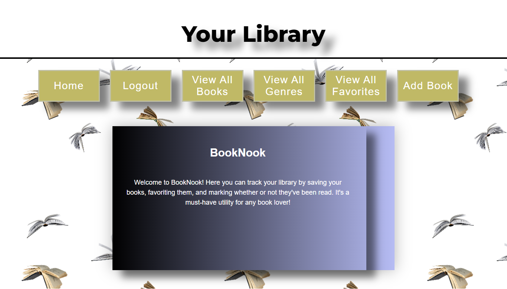
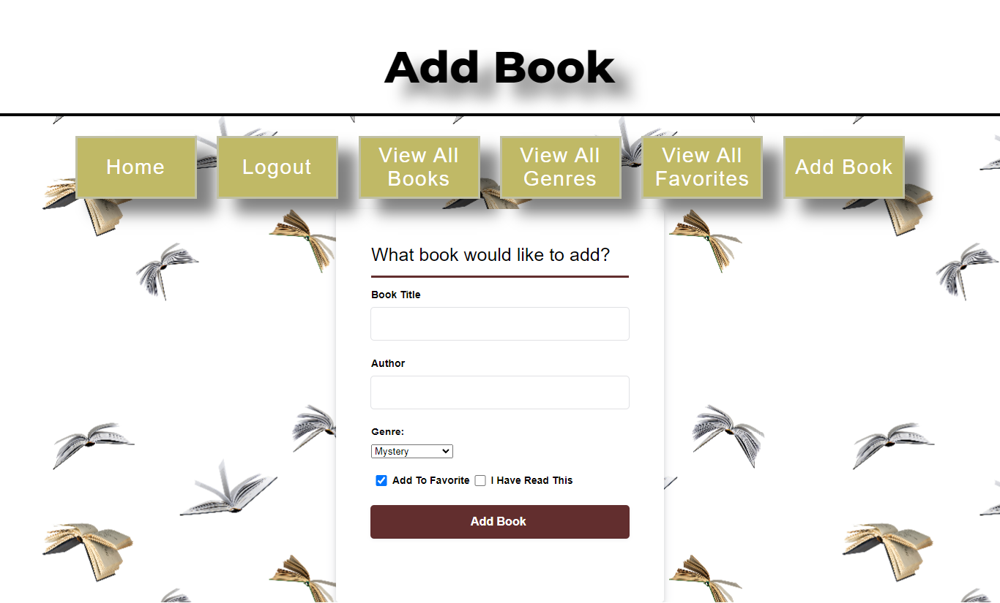

# BookNook

## Table of Contents
- [Description](#description)
- [Visuals](#visuals)
- [Technologies Used](#technologies-used)
- [Installation](#installation)
- [Usage](#usage)
- [Authors and Acknowledgements](#authors-and-acknowledgements)
- [Questions](#questions)
- [Resources](#resources)

## Description 
Welcome to BookNook! A digital library where a user can add books to their library to keep track of as well as add them to a favorites list and mark them as read whenever they finish that book. 

## Visuals

## Technologies Used
- Open library API
- ISBNDB API
- NodeJS
- Axios
- Connect Session Sequelize
- Bcrypt
- dotenv
- Express
- Express Handlebars
- Express Session
- MySQL2
- Sequelize
- eslint
- Nodemon

## Installation 
- First you will need to run the command npm init -y into your terminal. 
- Then you will need to either list all of these dependencies in your package.json and then run and npm install for all of them or run the command "npm install" followed by the technology required until they are all installed. 

## Usage

The first screen that the user will be prompted with will be a login/sign up sheet where they will either need to log in if they have an account already or sign up if they need to make a new account.

After either signing up or logging in the user will be brought to the homepage that has the header "Your Library", followed underneath by buttons for different paths to take within BookNook and then lastly underneath that will be a section about BookNook.

The paths you can take from here will be: Home, Logout, View All Books, View All Genres, View All Favorites, and Add Book. Clicking on each one will bring you to a different page within the website and they all present different options. 

Adding a book will prompt the user to input the name of the book, the author, select the genre from a dropdown menu and the user will have the option to check off if they have already read this book and if they want to add this book to their favorites list. Once finished the book will then be added to the user's library.

Once the user adds a book to their library the book will then be displayed on a card that will display the title, author, genre and if the user has read the book already and if it is in their favorites list. The user can also at any time mark the book as read when they have read it and choose to add the book to their favorites list if they would like by clicking on the book card and viewing the single book by itself. 

From the view all genres path, the user will be presented with different genre types and upon clicking on one of the genre types they will be presented by a list of all the books in that specific genre. 

The user also has the option to view all the books they have added to their favorites list by clicking the view all favorites path as well. 

No matter where the user traverses in BookNook the original buttons from the home page will always be there so the user can go wherever they want in their library. The books that the user adds to their library is specific to that user's library only and another user's library will not coexist with their's. 

## Authors and Acknowledgements
- Alice Silva
- Ben Ashworth
- Cody Theroux
- Kristin Kleyla
- Nick Thompson

## Questions
Questions, comments or concerns? Feel free to reach out to any of us by email: 
- Alice: silva.alicem@outlook.com
- Ben: bashworthj@gmail.com
- Cody: cody.theroux3@gmail.com
- Kristen: clever_disguises@yahoo.com
- Nick: thompsonnickolas1@gmail.com

## Resources
- [Repo Link](https://github.com/kleylakb89/book-nook)
- [Live Site](https://dry-bastion-57106.herokuapp.com/)